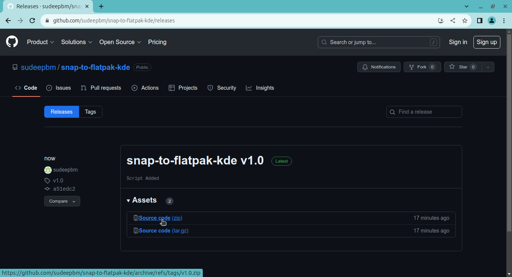
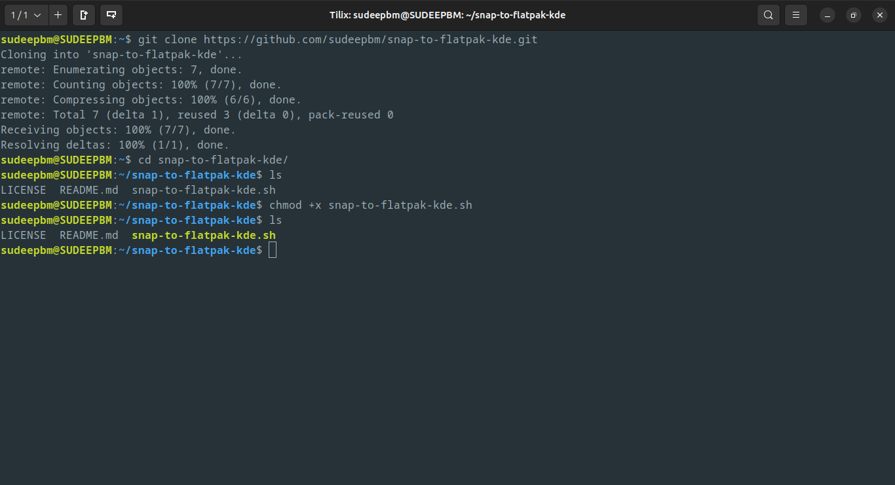

<h1 align="center">
   
</h1>

<h1 align="center">
   <b>snap-to-flatpak-kde</b>
</h1>

<p align="center"><b>Get rid of snap packages and install flatpak apps support</b></p>

## Introduction

This script helps in removing the [**`snap`**](https://ubuntu.com/blog/whats-in-a-snap) packages and install support for [**`flatpak`**](https://flatpak.org) apps.

This script will be helpful for those users who prefer flatpaks over snaps.

## Status of this script
This script is released as `v1.0` on September 1,2023.

This script has been tested on `Kubuntu linux 23.04`. This script will work on any Ubuntu based linux distro with snaps using `kde-plasma desktop environment`.

## Running the script

Clone [this](https://github.com/sudeepbm/snap-to-flatpak-kde.git) repo or download the zip from [releases](https://github.com/sudeepbm/snap-to-flatpak-kde/releases) section and unzip it.



``` {.bash}
git clone https://github.com/sudeepbm/snap-to-flatpak-kde.git
```


Then move to the snap-to-flatpak-kde directory

``` {.bash}
cd snap-to-flatpak-kde
```

Make the script executable by the following command.

``` {.bash}
chmod +x snap-to-flatpak-kde
```



Then run `snap-to-flatpak-kde.sh` script as a sudo user.

``` {.bash}
sudo ./snap-to-flatpak-kde
```

After this confirm to execute the script by typing `Y` or `y` or `YES` or `yes`. If you want to terminate the execution of the script at this stage, type `N` or `n` or `NO` or `no`.


Note : Please make sure to execute this script as a sudo user.

## Working of the script

1. The script will list all snap packages installed and remove them one by one until all snaps are removed completely. Then it will remove the snapd package permanently. It will then create a preference file to prevent the downloading of snaps in future.

1. The script will then install [**`KDE Software Centre`**](https://apps.kde.org/).

1. `Firefox` will be installed from the official mozilla repositories and creates a preference file to give priority to the mozilla repositories for future updates of Firefox.

1. **[`Flatpak`](https://flatpak.org)** support will be added by installing flatpak plugin for the gnome software centre and adding the flatpak repo.

1. Wait patiently for the script to complete it's work.
<!---

-->
_**Note : This script will delete all data of snap packages and will not be recoverable unless you have taken an earlier backup**_

## Feedback

If you have any feedback, please reach out to me at [Mail](mailto:contact-me_github.w4cp8@aleeas.com) 

## Authors

- [@sudeepbm](https://www.github.com/sudeepbm) 

## Friendly notice

**It is important to clarify that the intention here is not to criticize the quality of Snaps or to cause any form of harm. The provided script intends to offer assistance to individuals who hold a preference for Flatpaks.**

## Disclaimer
This script is provided as-is. Use it at your own risk. it worked on my system so idk if it will work on yours.

## License

Licensed under [MIT LICENSE](LICENSE)

##

_**If you found this repo useful, don't hesitate to share with others.<br>
Feel free to report issues if any.**_
